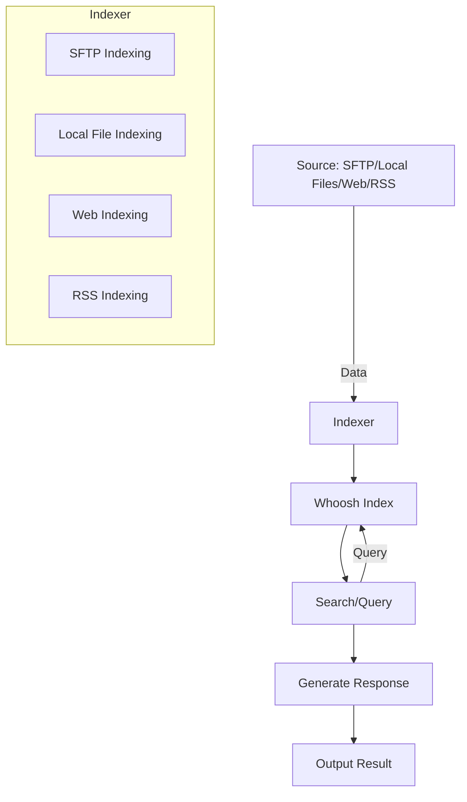

## SmartIndexLLM

SmartIndexLLM allows you to index data from text and pdf files which can then be use in prompts with a locally running large language model (LLM).
  
As an example, let say that you have a PDF file that contains techinal information about game consoles. Then you want to know somethingö
At high level you are able to make query to the indexed data from the pdf, like `playstation AND cpu`, and then you can give the LLM a prompt like `Give me details about PS5's CPU`.
Response from the index query and the prompt are then combined, so the LLM can answer with the data you provided from the index.



## Ollama deployment

The used LLM(s) needs to be found as pulled in Ollama.
You can install Ollama in any way you want as long as it's listening on TCP port 11434.
The folder `deploy_ollama` contains sample Ansible playbook for one deployment option.
It deploys Ollama to docker and then models can be pulled like this:

```bash
$ docker exec -it ollama ollama pull llama3.2:3b
```

## Usage

Check `SmartIndexLLM` directory's readme for configuration and usage instructions.
