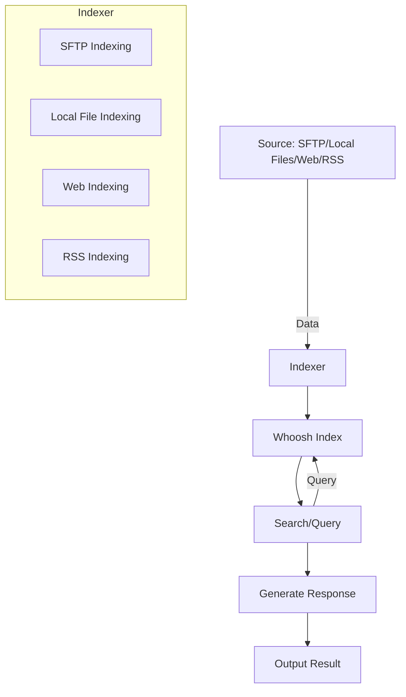

## SmartIndexLLM

SmartIndexLLM allows you to index data from text and pdf files which can then be use in prompts with a locally running large language model (LLM).



## Ollama deployment

The used LLM(s) needs to be found as pulled in Ollama.
You can install Ollama in any way you want as long as it's listening on TCP port 11434.
The folder `deploy_ollama` contains sample Ansible playbook for one deployment option.
It deploys Ollama to docker and then models can be pulled like this:

```bash
$ docker exec -it ollama ollama pull llama3.2:3b
```

## Indexing

There's multiple scripts for different indexing use cases.
Indexing supports PDF or TXT files based on extension `.txt` and `.pdf`.

All indexing is done via `index.py` and configured with `python3 index.py -c <path to YAML conf>`.
Configuration for each indexing type is explained below.

### Local file

`x`

### SFTP

Configure SFTP instances where to copy files. One per remote path even if all remote paths are in the same server.

```yaml
sftp:
  - hostname: '127.0.0.1'
    port: 22
    username: user
    # currently only ed25519 key is supported
    private_key: ~/.ssh/id_ed25519
    # Copy TXT of PDF files from here...
    remote_directory: /opt/dokuwiki/config/
    # ...to this directory. Files are then read and indexed from this local path.
    local_directory: data/wikipages
  - hostname: and so on
    ...
```

Note. SFTP files are downloaded to local machine and then indexed from the local path.

### Web

Configure web paths

`x`

### RSS

`x`

## Searching

```bash
$ python3 search_prompt.py --whoosh_query 'cert*'  --ollama_prompt "How do I renew certificate in my homelab?" --model myllama3.2_3b
```

```py
python3 search_prompt.py --whoosh_query 'pam_unix' --ollama_prompt 'Has there been any authentication related anomalies? State list of anomalies with dates and usernames' -c conf/config.yaml
```

## Prompt LLM via Ollama and provide context from Whoosh search

```bash
$ python3 search_prompt.py --whoosh_query 'LED' --ollama_prompt 'How can LED lights be used in cyber attack?'
```

## Debugging

You can use the provided test script to query the index.


```bash
$ python3 tests/search.py 'xyz and (foo or bar)'
```

Or you can dump the whole index.

```bash
$ python3 tests/dump_index.py
```
